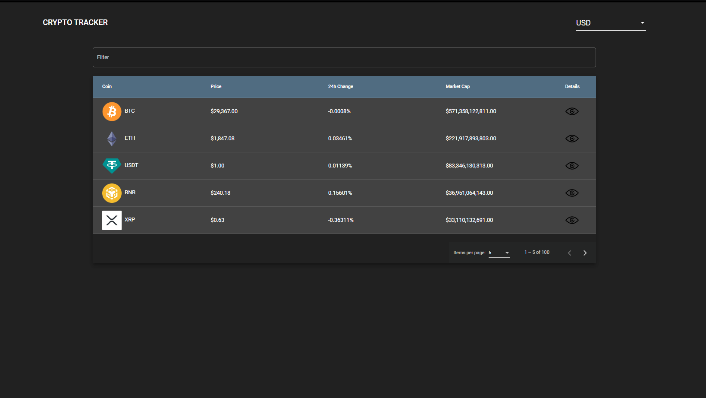
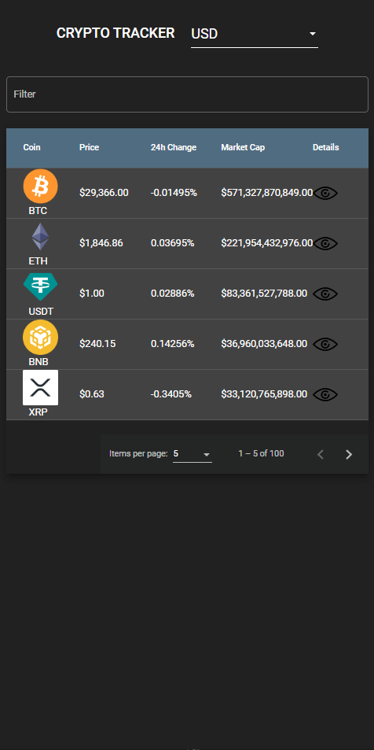
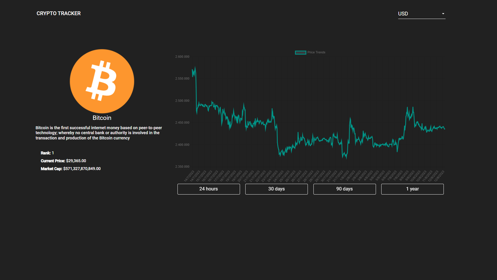
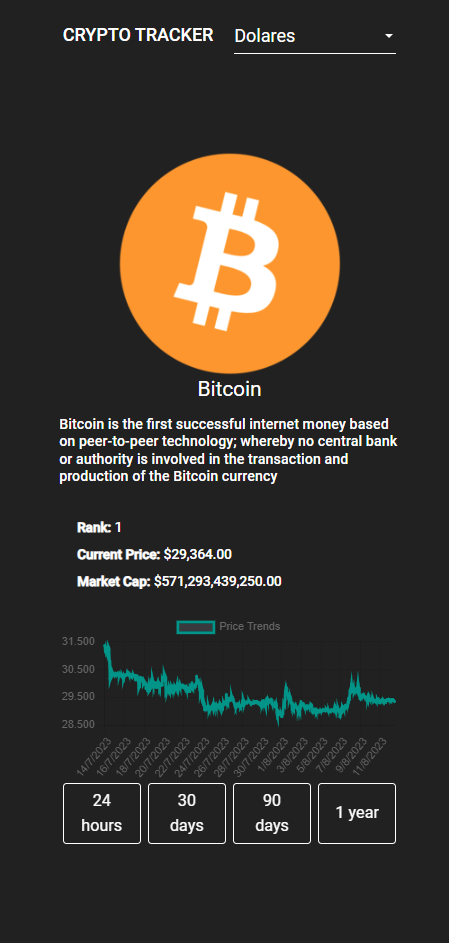

# **App Crypto tracker**

 

 

## Características Principales 🌟:

- **Exploración de Criptomonedas 🕵️‍♂️**: Los usuarios pueden explorar una amplia gama de criptomonedas disponibles en la API, accediendo a detalles clave como nombre, símbolo y precio actual.

- **Búsqueda y Filtrado 🔍**: Permite a los usuarios buscar criptomonedas específicas por nombre o símbolo, lo que facilita el acceso a la información deseada de manera rápida. Además, los usuarios pueden filtrar las criptomonedas según ciertos criterios, como el precio actual, el volumen de operaciones y la capitalización de mercado.

- **Cambio de Valor de Cambio 💱**: Permite a los usuarios cambiar el valor de cambio de moneda para mostrar los precios en diferentes divisas, como soles, euros y dólares. 

- **Paginación Eficiente ⏩**: Para mejorar la usabilidad, la aplicación implementa un sistema de paginación que muestra un número manejable de criptomonedas por página, permitiendo a los usuarios explorar de manera cómoda y ordenada.

- **Visualización de Precios a lo Largo del Tiempo 📈**: Posibilidad de visualizar el historial de precios de una criptomoneda en un gráfico interactivo. Se puede seleccionar un período de tiempo específico, como los últimos meses, y observar cómo ha variado el precio de la criptomoneda en ese período.

## API:

      https://api.coingecko.com/api/v3/

## Restricciones 🛑:

La aplicación utiliza la versión gratuita de la API de criptomonedas **coingecko**. Esto significa que hay un límite de peticiones por período de tiempo. Si la aplicación recibe muchas peticiones en un corto período, es posible que se alcance el límite. En consecuencia, la aplicación puede experimentar tiempos de respuesta más lentos o incluso fallas temporales si se supera este límite.
